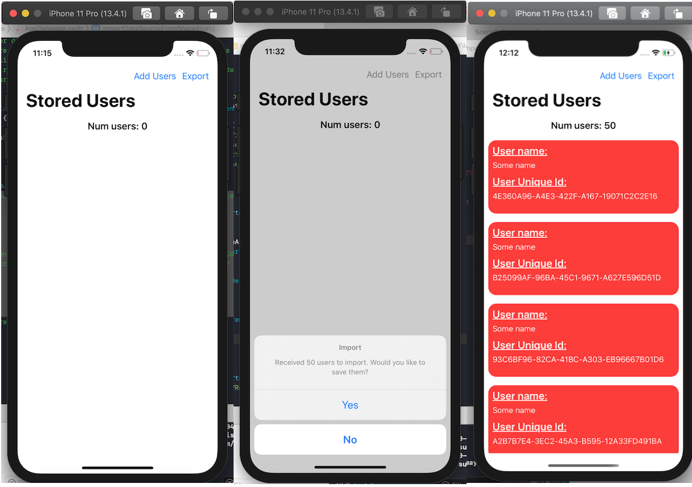

# RealmShare

RealmShare is a demo app for showing how to share RealmSwift objects between two devices running the same app. 

## Sharing data

 

    

    
    

Sharing data can be done using the typical `UIActivityViewController`. In this example, data can be airdropped to another
device, and if the other device has this app downloaded, it will automatically open and prompt you to update the records
with the imported data.

You would need two  for this.

However, you may email the data as well in the form of a `.usrl` or `.ucsv` file, which stands for User List and User CSV respectively.
The UCSV file generates a csv-formatted file which may be useful in other places, although this was a bonus.
 
